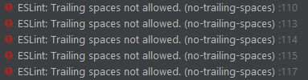

My first experience with coding standards was in my intro to comp sci class. This was before I chose computer science as my major. Not really knowing anything about coding and programming, I viewed it as a way of making code look pretty. If everything you write is in the same coding standard, then it all looks organized, sleak, and easy to read. 

Having learned slightly more about coding and programming, I've learned that some coding standards can actually help you with a lot more than looking organized. With the help of something like ESLint, it can make you a better programmer. 

## ESLint

ESLint is a tool that looks through your code as you type it, and notifies you of any errors. It is super useful when coding with Javascript. The error messages it gives are super accurate, and it gives suggestions for exactly what to change. When there are no errors, it gives you a green checkmark. 

## My Experience with ESLint

After using ESLint with IntelliJ for about a week, my impressions of it is that it is really picky. It's like that friend who's hard to eat with because they don't like a lot of things. For example, I have this habit of adding a space to the end of every single line. It's just how I naturally type. Once I finish a sentence or thought, I hit space bar. Ending a line with a semi colon, I hit space bar. ESLint hates this. Everytime I code, it gives me 10 error messages telling me to remove the useless space at the end of each line. 

  

It also doesn't like it when you create a varible that is not being used, even if you've just typed the variable and have had no time to use it because you literally just typed it. It wants you to use it now. 

*ESLint: 'variable' is assigned a value but never used. (no-unused-vars) : 119*

Now, all this may sound like I'm complaining about ESLint, but I actually really enjoy it. Picture that picky friend again. Now imagine if they knew every menu item of every resturant that existed on this planet, and they told you exactly which places they would like to go. ESLint points out every single thing it doesn't like about your Javascript code, but it tells you exactly what its problem with your code is. This is how it makes you a better programmer. 

Not only will ESLint fix your spacing, it will tell you whether things are unnecessary. Why create a variable that you never use again. ESLint goes so far as to completely get rid of an else block if it's unnecessary. Why store a result in a variable when you're going to return it the next line, and can just return the result directly.

ESLint may be a very picky friend, but they are a decisive picky friend. Rather than just rejecting every option you give it, it provides feedback. You never need to know what it wants. It makes that very clear. And getting that green checkmark at the end of that day feels really nice. 
