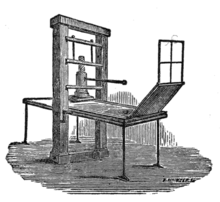

## HTML and CSS

If you wrote a book, and you wanted to be able to make several copies to distribute to many people, how would you do it. If you lived under a rock and knew nothing about the modern world, perhaps your first thought would be to copy the book by hand. Let's say you spend several hours rewritting your book over and over again so that it can be shared with multiple people. This solution of course works, in that several people would now be able to read your book all at the same time, but it's maybe not the most effective solution. Let's say you decide to have multiple people copy your book by hand. Now you can make several copies at a much faster pace. Yet still, this solution is not incredibly effective. 

Introducing the printing press: 

  

This machine allowed for the mass production of printed material. This is the essence of a design pattern. A design pattern in software engineering is a repeatable solution to a commonly occuring problem in software design. The printing press not only made the copying of books efficient, but the copying of any printing material. If someone wanted to make several copies of a newspaper, the solution to copying books would also provide a solution to copying newspapers. There are many problems in software design that can be solved using the same solution, even if it is not the exact same problem. 

[ohanascholars.org](https://ohanascholars.org/).
