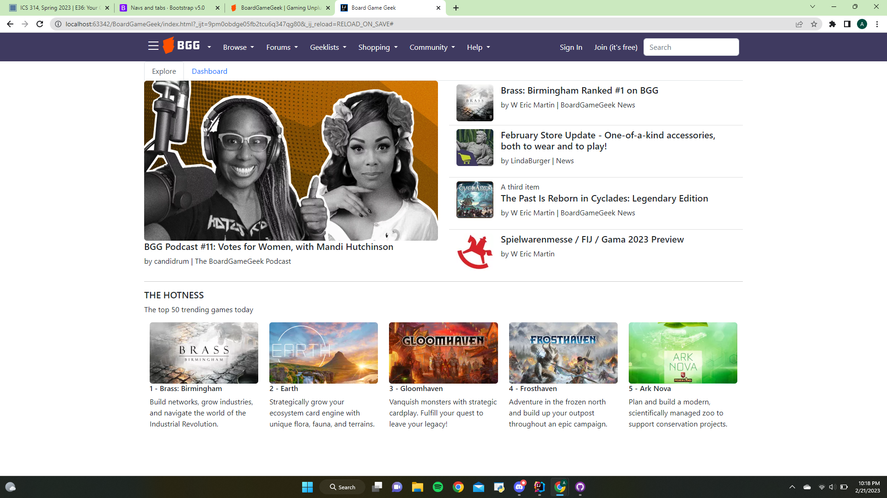

## HTML and CSS

If you wrote a book, and you wanted to be able to make several copies to distribute to many people, how would you do it. If you lived under a rock and knew nothing about the modern world, perhaps your first thought would be to copy the book by hand. Let's say you spend several hours rewritting your book over and over again so that it can be shared with multiple people. This solution of course works, in that several people would now be able to read your book all at the same time, but it's maybe not the most effective solution. Let's say you decide to have multiple people copy your book by hand. Now you can make several copies at a much faster pace. Yet still, this solution is not incredibly effective. 

Introducing the printing press: 

This machine allowed for the mass production of printed material. This is the essence of a design pattern. A design pattern in software engineering is a repeatable solution to a commonly occuring problem in software design. 

Bootstrap 5 is a CSS framework for creating responsive webpages in a faster and easier way. It lets you create buttons, cards, dropdowns, lists, tabs, and so many other things that help format your webpage. You can create a navbar that goes at the top of your site, and a footer at the bottom. You can create icons that link to different social media platforms and add search bars. You can format things using rows and columns. Most importantly, you can create these things quickly, and they'll look good on any size screen. This sounds great! Why would anyone not want to use Bootstrap? 

## My Experience with Boostrap

Bootstrap is not easy to learn. For me, a lot of it was just messing around with different things to learn how different classes affect each element on the webpage. It takes time to get used to using it. A lot of elements can have long classes such as *class="flex-sm-fill text-sm-center nav-link active"* where each pieces of text does something different. There were many times where I just couldn't get the webpage to look the way that I wanted it to and the solution was to add or remove something from one of the classes. 

Still, the learning curve was worth it and the struggle of learning Bootstrap is so much better in the long run than the struggle of trying to make a webpage look nice with just HTML and CSS. 

Below is a copy that I made of the website [boardgamegeek.com](https://boardgamegeek.com/). The links do not work, though it would be possible for me to make them work. This solely serves to show you that you make a webpage look good using Bootstrap. 

  

