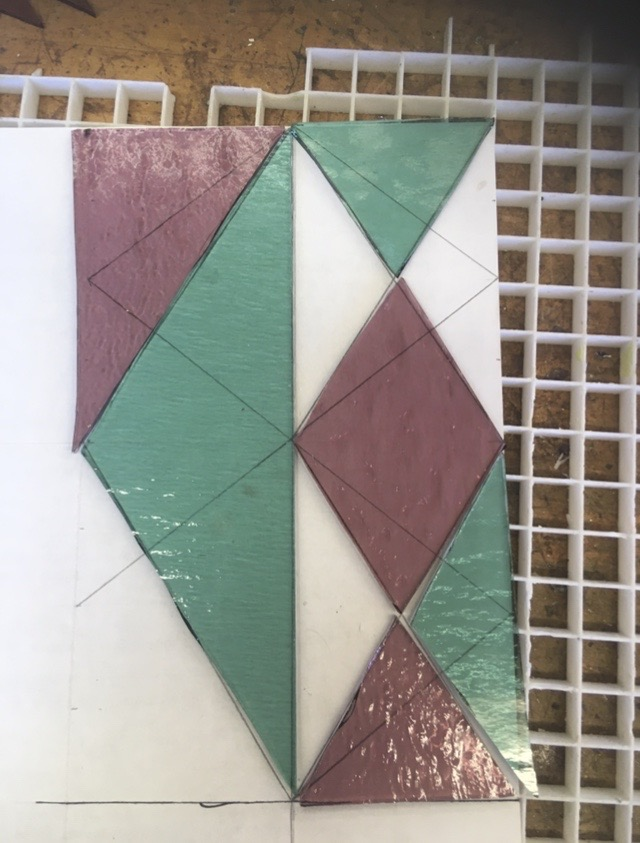
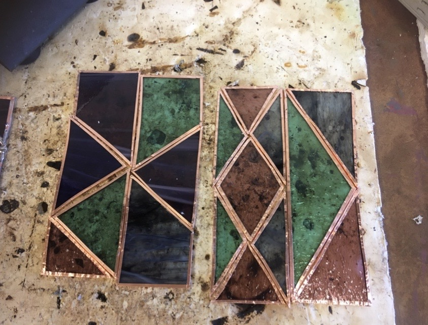
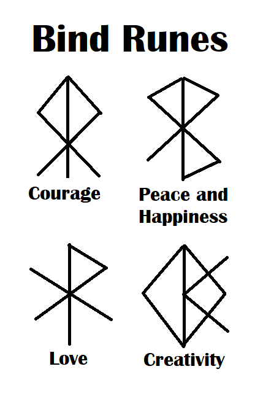
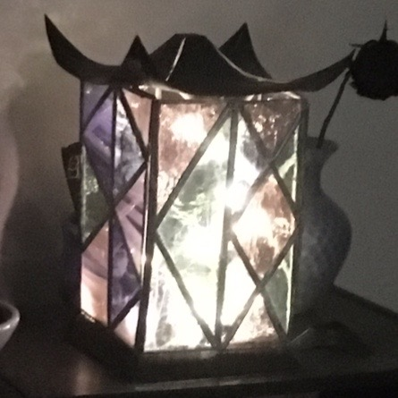

  
  

Senior year of High School, I created a lantern for a class called "Creative Metals and Glass." 

## How it was made 

I cut the copper metal into two square pieces, which I shaped into the top and base of my lantern. I stained the copper pieces black by using liver of sulfur, a mixture that oxidizes the copper, turning it black. 

I then cut the different colored stained glass pieces into triangular and quadrangular pieces using a diamond cutter. The design of the windows for the lantern were based off the bind runes for courage, happiness, love, and creativity. I taped the edges of each piece of glass with copper foil tape. The tape lets me solder together the glass pieces, because the solder will stick to the copper and not the glass itself. To solder the pieces together, I added flux to the copper foil tape, and used a soldering iron to go along the edges of the copper tape making sure to fill in the gaps between each of the pieces. Once I finished one of the sides of the panes of glass, I'd flip it over and repeat the process. At the end, I went over the solder once more on each side to make sure it was smooth. Once all the stained glass panes were done and cooled, they were soldered together. A copper wire and copper tube were soldered to two different glass panes to create a hinge for the lantern to be opened. The base and top metal pieces were glued to the glass panes to finish the lantern. The picture below shows the lantern with fairy lights inside. 

  

