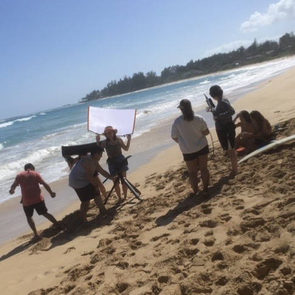
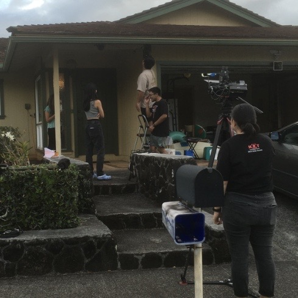
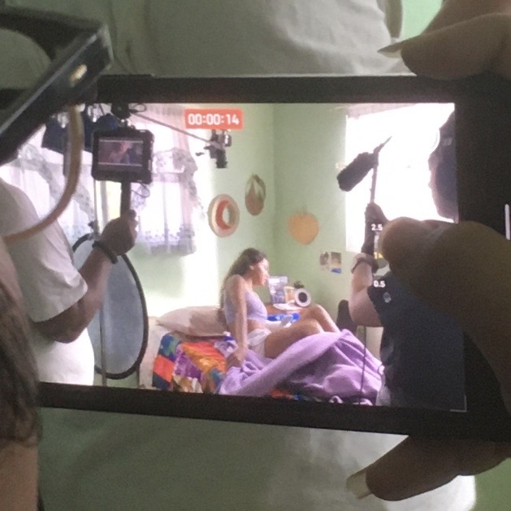
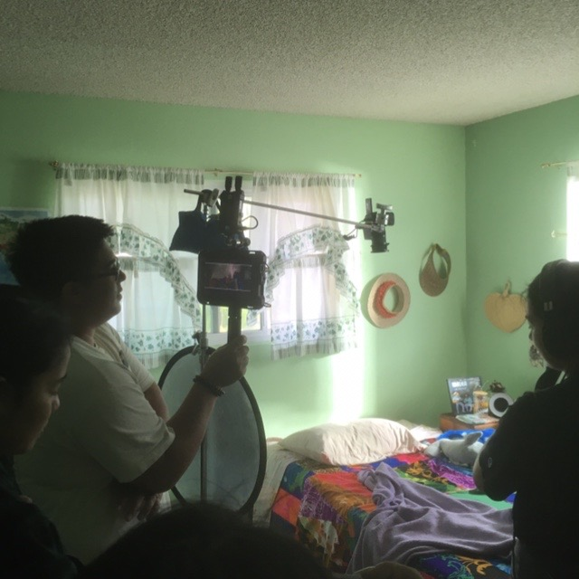
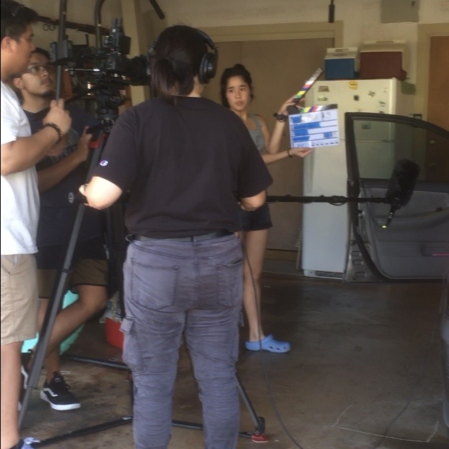

  
  
  

In 2022, a friend of mine reached out to me asking me whether or not I'd be willing to help her with a short film that she was planning to create. I said yes. A couple of months later, she shared an excel spreadsheet with everyone involved that had everything that was needed for the short film. Under the contact tab, I found my name next to the title "Script Supervisor." I had no idea what a Script Supervisor was. 

## What is a Script Supervisor? 

A Script Supervisor is the person on set in charge with mainting continuity. They take notes on all scenes, commenting on which scenes looked good to the director, which were good for camera crew, and which were good for sound. These notes will untilmately help editing for post production. 

## My experience

When I showed up for the first film day, I was handed a binder with all the papers I would need to fill out. The main one was on the back of all the script pages where you could take notes for each scene. The camera crew gave me an iPad that was synced with the camera so I, and the director, could see what the camera was seeing as we filmed. I didn't know either of the two camera crew guys, nor the girl operating the boom prior to shooting, but as we continued to film, the whole cast and crew got pretty comfortable with each other. We filmed for about 12 hours a day, 4 days straight. 

As the days went on, I got used to taking notes from the director, camera crew, and boom operator. 

  
  
  

