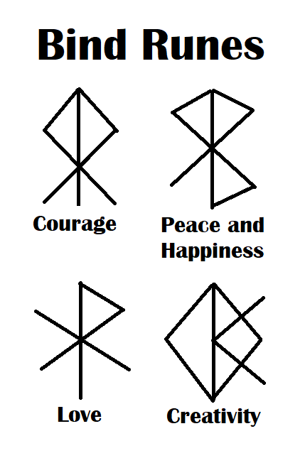

  
  

## Ohana Scholars

Ohana Scholars is a web application designed to help students at UH Manoa create and join study sessions where they can learn and work on homework together. 

## My Contribution

I was specifically in charge of creating the list sessions page and the create a new session page. After creating a profile, students can create new study sessions specifying where to meet, at what time, for what class/course, and any additional notes such as what other students should bring to the study session. Students can also browse the list of already created study sessions to join sessions already created, and filter sessions by their courses. 

## What I learned

During the semester, we learned how to create web applications and as we learned more, I thought I was getting the hang of it. Then, when we were given this project, I realized that despite me learning a lot, there is so much more to learn. 

  

