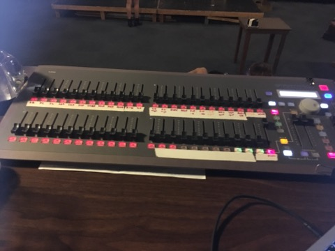
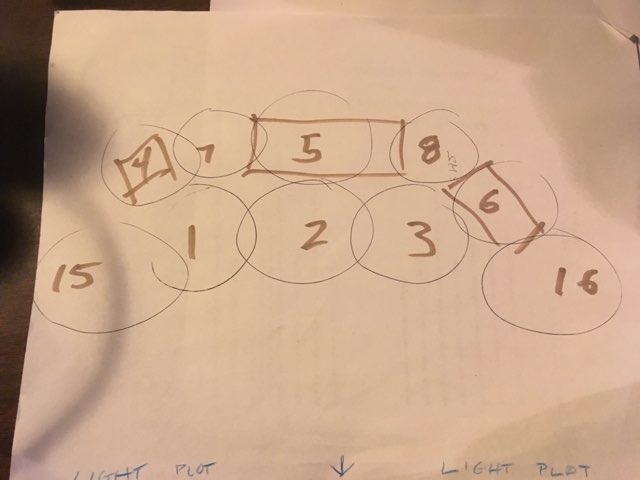

  
  

My high school, in addition to the Fall and Spring main stage plays, would put on student directed plays. 

Source: <a href="https://github.com/jogarces/ics-313-text-game"><i class="large github icon "></i>jogarces/ics-313-text-game</a>
